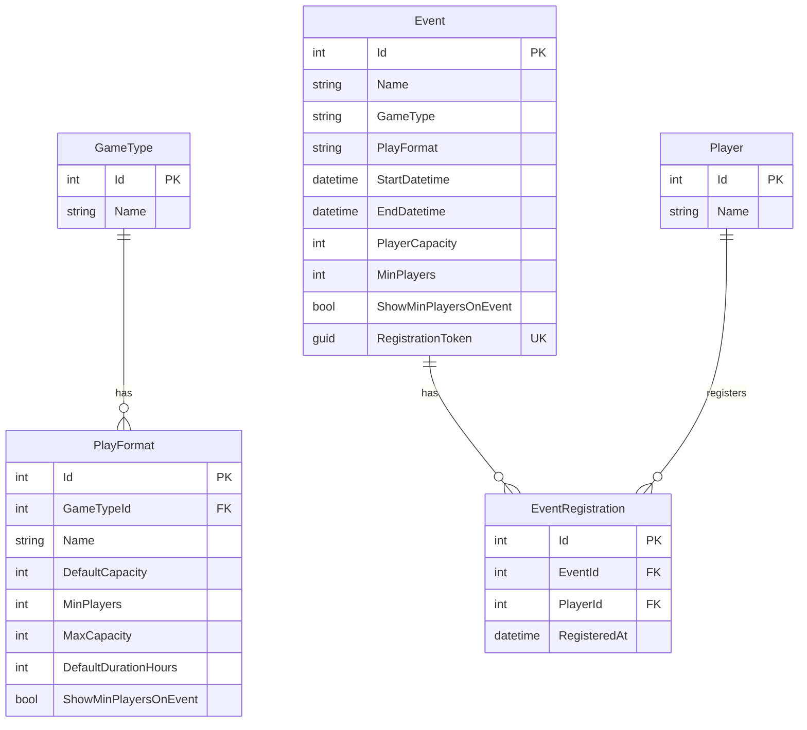

# Trading Card Event Calendar

A lightweight event calendar web application for trading card games. Schedule events using game-type templates, share registration QR codes, and let players register online with server-enforced capacity limits.

## Features

- **React + FullCalendar** — month, week, and list views
- **Play format templates** — each game type has formats with their own capacity rules and defaults
- **Schedule events** — name, game type, play format, start/end time, player capacity
- **Registration** — unique link + QR code per event; capacity enforced on the server with SQLite row locking
- **Calendar invites** — download `.ics` files (Google Calendar, Outlook, Apple Calendar)
- **SQLite + C# API** — ASP.NET Core 10 backend with Entity Framework Core
- **Docker deployment** — single `docker compose up` builds React UI and API
- **Backend unit tests** — xUnit tests for registration and template validation services

## Play Format Templates

Each **GameType** has one or more **PlayFormat** templates that control:

| Field | Purpose |
|-------|---------|
| `defaultCapacity` | Pre-fills the capacity input when scheduling |
| `minPlayers` | Minimum allowed capacity (enforced client + server) |
| `maxCapacity` | Upper cap per format (30 for most formats; Draft 24; YGO Sealed 16) |
| `defaultDurationHours` | Pre-fills end time from start |
| `showMinPlayersOnEvent` | Shows "Minimum N players" on event pages |

### Seeded formats

**Magic: The Gathering**

| Format | Default cap | Min | Max |
|--------|-------------|-----|-----|
| Standard | 30 | 2 | 30 |
| Modern | 30 | 2 | 30 |
| Commander | 16 | 2 | 30 |
| Draft | 8 | 8 | 24 |

**Pokemon TCG** — Standard, Expanded, Limited (default 16–24, min 2, max 30)

**Yu-Gi-Oh!** — Advanced, Traditional (max 30); Sealed (default 8, min 2, max 16)

## Quick Start (Docker)

```bash
docker compose up --build
```

Open [http://localhost:8080](http://localhost:8080).

## Local Development

Requires [.NET 10 SDK](https://dotnet.microsoft.com/download) and Node.js 18+ (20 recommended).

### Full stack (build UI + run API)

From the repo root:

```bash
npm install --prefix frontend   # first time only
npm run start
```

Open [http://localhost:5000](http://localhost:5000) — API serves the production-built React app from `wwwroot`.

Other root scripts:

| Script | Description |
|--------|-------------|
| `npm run build` | Build frontend into `backend/.../wwwroot` |
| `npm run start:api` | Run .NET API only (no frontend rebuild) |

### Tests

```bash
dotnet test TradingCardEventCalendar.sln
```

## Database reset

The project uses `EnsureCreated()`. After schema changes, delete the database and restart:

```bash
# Local
rm backend/TradingCardEventCalendar.Api/Data/calendar.db

# Docker — remove the volume
docker compose down -v
docker compose up --build
```

## Entity Relationship Diagram

SQLite schema managed by EF Core `EnsureCreated()` in [`AppDbContext.cs`](backend/TradingCardEventCalendar.Api/Data/AppDbContext.cs).



**Template linkage:** `Event` is not foreign-key linked to `GameType` or `PlayFormat`. It stores `GameType` and `PlayFormat` as string snapshots (along with copied `MinPlayers` and `ShowMinPlayersOnEvent`). [`TemplateValidationService`](backend/TradingCardEventCalendar.Api/Services/TemplateValidationService.cs) validates those names against seeded templates when an event is created or updated.

**Constraints:**

- `Event.RegistrationToken` — unique index
- `EventRegistration (EventId, PlayerId)` — unique composite index (one registration per player per event)
- Cascade deletes: deleting an event removes its registrations; deleting a game type removes its play formats

## API Endpoints

| Method | Path | Description |
|--------|------|-------------|
| GET | `/api/gametypes` | Game types with nested play format templates |
| GET | `/api/events` | List events (optional `start` / `end` query filters) |
| POST | `/api/events` | Create event (template validation) |
| PUT | `/api/events/{id}` | Update event |
| DELETE | `/api/events/{id}` | Delete event |
| GET | `/api/events/public/{token}` | Public event details |
| POST | `/api/events/public/{token}/register` | Register player (409 when full) |

## Validation summary

| Field | Frontend | Backend |
|-------|----------|---------|
| Event name | Required, max 100 chars | EF max 200 chars on save |
| Player name | Required | Required, max 100 chars, unique per event (case-insensitive) |
| Capacity | Min/max from selected format | Template rules + cannot drop below registration count on update |
| Dates | End after start | End after start |

## Design write-up questions answering:
     - How did you determine and enforce how many people can attend an event? Where does capacity live, and what happens under concurrent registrations for the last seat?
     Based on the requirements there is a maximum of 30 players, I used cursor and personal knowledge to add some more limits like minimum players per format. 
     The capacity lives in the Event table, when registering a user this value is checked
     For the concurrency I  ensured that the check happens in the backend as well as the front end. Also added explicit db locking on writes. 
     - How does your template system work, and what would adding a 4th game (or a non-card game) require?
     The template system has two entities GameType, and Format. Currently you can add default values to the AppDbContext.cs file for both GameType and any associated play formats. I ran out of time here, but I should have added a controller to add a new gameType.
     - What did you deliberately cut or fake to stay in the timebox, and what would you build next?
     I think I covered most of the requirements, the templating portion of the game types I feel I would need clarification on what the ask is. I set out with a fairly simple template, but could expand to have different fields for each game type/ format.
     Things like maybe the set/expansion name to the particular event would be helpful. 
     Creation of both an API and possibly a form to add new GameTypes and formats. 
     I added unit tests for the backend, but would want to implement additional front end unit tests as well. 
     While not in the requirements some better form of user registration based on email. Its currently validating just based on the name value which is bad. But also theres no requirement so putting off for later iterations.
     Another additional feature that would be helpful is a player list, and even exporting functions/integrations with bracketing software like challonge or melee.
     Adding a share option for the QR code to quickly print or send to socials
     Adding a recurring event option 
     Theres no state of an event being started, could add that and validation for minimum number of players.
     Event duration is also in a weird state not sure how much its needed I'd assume most events would just run until they are done, totally get they are used for the ICS calendar files though.     

## AI usage note (a few sentences):** which tools you used and for what, and one example of AI output you rejected or had to fix.
I used cursor for most of the code generation with the following initial input. I followed up with some additions to the eventRegistration and QR code features I missed. I also used AI to do some troubleshooting with my docker and wsl installation as my personal machine did not have these

Removed:
-The entire PlayerController as the only interaction with the players is on registration. Theres no player maniuplation outside the context of an event
-getEvent frontend endpoint
-An Extra tsconfig.app.json was created and is unused
-EventPageUrl was not really being used as event pages are not needed just registration and the calendar itself

Also used Cursor to review security vulnerabilities such as SQL injection and create a plan. Reviewed the results in SECURITY_REPORT.md. Addressing the sqlite vulnerability
Updated the README using cursor for formatting and diagrams

Initial AI input:
Create a small calendar web application that uses a docker container for local deployment. The calendar will have an option to schedule events, view events. The backend will use a sqlite db. The backend code should use c#.
the basic entities are Entities:
Event 
- id int
- name text
- gameType text
- startDatetime datetime
- playerCapacity int

Player
- id int
- name text

GameType
- id int
- name text
- playFormats text
- maxCapacity int
- minPlayers int

A lightweight event calendar web application for trading card games. Schedule and view events for Magic: The Gathering, Pokemon TCG, Yu-Gi-Oh!, and other games.