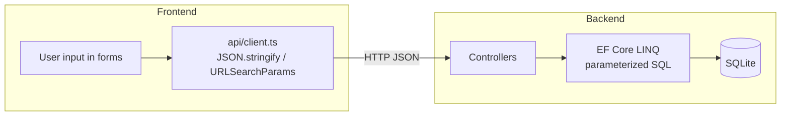

# Security Vulnerability Audit Report

**Project:** Trading Card Event Calendar  
**Date:** 2026-08-01  
**Scope:** Read-only review — frontend, backend API, dependencies  
**Environment tested:** Local API at `http://localhost:5000` (fresh SQLite DB via `EnsureCreated`)

---

## Executive Summary

| Area | Result |
|------|--------|
| **Frontend SQL injection** | **Not applicable** — the React app does not execute SQL |
| **Backend SQL injection** | **Low risk** — all database access uses EF Core LINQ (parameterized queries); no raw SQL found |
| **Frontend XSS** | **Low risk** — no unsafe DOM APIs; React text rendering escapes HTML |
| **Top practical risk** | **High** — unauthenticated event create/update/delete on `/api/events` |

The application is reasonably protected against SQL injection and DOM-based XSS in its current architecture. The most significant gaps are missing authentication on administrative endpoints, permissive CORS combined with open writes, and absent rate limiting on public registration.

---

## Findings Summary

| ID | Severity | Finding | Location |
|----|----------|---------|----------|
| SEC-01 | **High** | Unauthenticated event create/update/delete | `EventsController.cs` |
| SEC-02 | **Medium** | CORS `AllowAnyOrigin` on all methods/headers | `Program.cs` |
| SEC-03 | **Medium** | No rate limiting on public registration | `PublicEventsController.cs` |
| SEC-04 | **Medium** | Event name length not validated at controller layer (201+ chars accepted) | `EventsController.cs`, `AppDbContext.cs` |
| SEC-05 | **Low** | ICS calendar files embed user-controlled event title/description | `CalendarInviteButton.tsx` |
| SEC-06 | **Low** | Malformed public token URLs fall through to SPA (200 HTML) instead of API 404 | `Program.cs` routing |
| SEC-07 | **Low** | Backend SQL injection mitigated by EF Core (no raw SQL today) | All `.cs` data access |
| SEC-08 | **Info** | No CSP, HSTS, or `X-Content-Type-Options` headers | `Program.cs` |
| SEC-09 | **Info** | CDN-hosted FullCalendar CSS (jsDelivr) | `frontend/index.html` |
| SEC-10 | **Info** | Transitive SQLite native library advisory (NU1903) | `SQLitePCLRaw.lib.e_sqlite3` 2.1.11 |
| SEC-11 | **Info** | npm dev-tool advisories (Vite, esbuild, react-router) — dev/build only | `frontend/package.json` |
| SEC-12 | **N/A** | Frontend SQL injection — not applicable | `frontend/src/api/client.ts` |

---

## Detailed Findings

### SEC-01 — Unauthenticated Event Management (High)

**Description:** Any client that can reach the API may create, modify, or delete events without credentials.

**Evidence:**
```
POST /api/events → 201 Created (no Authorization header)
DELETE /api/events/1 → 204 No Content (no Authorization header)
```

**Location:** [`backend/TradingCardEventCalendar.Api/Controllers/EventsController.cs`](backend/TradingCardEventCalendar.Api/Controllers/EventsController.cs)

**Recommendation:** Add authentication (API key, OAuth, or ASP.NET Identity) and authorize write operations before production deployment.

---

### SEC-02 — Permissive CORS (Medium)

**Description:** `AllowAnyOrigin().AllowAnyMethod().AllowAnyHeader()` permits any website to invoke the API from a browser context.

**Evidence:**
```
OPTIONS /api/events
Access-Control-Allow-Origin: *
```

**Location:** [`backend/TradingCardEventCalendar.Api/Program.cs`](backend/TradingCardEventCalendar.Api/Program.cs) lines 16–19

**Recommendation:** Restrict CORS to known origins, or remove CORS if the SPA is always same-origin.

---

### SEC-03 — No Registration Rate Limiting (Medium)

**Description:** Public registration accepts unlimited requests. Attackers with a registration link can spam names or attempt automated squatting.

**Evidence:** Five concurrent registration requests to a capacity-2 event: 2 succeeded (200), 3 rejected (409 Conflict). No throttling observed.

**Location:** [`PublicEventsController.cs`](backend/TradingCardEventCalendar.Api/Controllers/PublicEventsController.cs), [`RegistrationService.cs`](backend/TradingCardEventCalendar.Api/Services/RegistrationService.cs)

**Recommendation:** Add per-IP or per-token rate limiting; consider CAPTCHA for public forms.

---

### SEC-04 — Event Name Length Not Enforced at API Layer (Medium)

**Description:** `AppDbContext` defines `HasMaxLength(200)` for event names, but `EnsureCreated()` does not always enforce CHECK constraints the same way migrations do. A 201-character name was accepted and stored.

**Evidence:**
```
POST /api/events with name = 201 × 'A' → 201 Created
GET /api/events → nameLen=201
```

**Location:** [`EventsController.cs`](backend/TradingCardEventCalendar.Api/Controllers/EventsController.cs), [`AppDbContext.cs`](backend/TradingCardEventCalendar.Api/Data/AppDbContext.cs)

**Recommendation:** Add explicit controller validation (`name.Length <= 200`) matching the player-name pattern in `RegistrationService`.

---

### SEC-05 — ICS Content Injection (Low)

**Description:** Event titles and descriptions from the database are embedded in downloadable `.ics` files. A malicious event name like `<script>alert(1)</script>` would appear in the calendar file. This affects calendar client parsing, not browser DOM XSS.

**Location:** [`frontend/src/components/CalendarInviteButton.tsx`](frontend/src/components/CalendarInviteButton.tsx)

**Recommendation:** Sanitize or strip control characters from ICS fields if untrusted users can create events.

---

### SEC-06 — Invalid Token URL Returns SPA HTML (Low)

**Description:** `/api/events/public/not-a-guid` does not match the `{token:guid}` route constraint and falls through to `MapFallbackToFile("index.html")`, returning HTTP 200 HTML instead of a JSON 404.

**Evidence:**
```
GET /api/events/public/not-a-guid → 200 text/html (SPA shell)
GET /api/events/public/00000000-0000-0000-0000-000000000000 → 404 {"message":"Event not found."}
```

**Recommendation:** Add explicit API fallback routing or a catch-all API 404 before the SPA fallback.

---

### SEC-07 — Backend SQL Injection (Low — Mitigated)

**Description:** Static analysis found zero uses of `FromSqlRaw`, `ExecuteSql`, or string-interpolated SQL. All queries use EF Core LINQ.

**Probe evidence:**
```
POST register {"name":"' OR 1=1--"} → 200
  Response: {"playerName":"' OR 1=1--"}  (stored as literal string, not executed)
GET /api/events?start=2026-01-01' OR 1=1-- → 400 (invalid DateTime, no SQL error)
```

**Recommendation:** Maintain policy of no raw SQL; use parameterized queries if raw SQL is ever added.

---

### SEC-08 — Missing Security Headers (Info)

**Description:** No Content-Security-Policy, Strict-Transport-Security, or X-Content-Type-Options configured.

**Recommendation:** Add security headers middleware for production deployments.

---

### SEC-09 — CDN CSS Dependency (Info)

**Description:** FullCalendar styles loaded from `cdn.jsdelivr.net`. Compromise of the CDN could alter styling (no script execution in current setup).

**Location:** [`frontend/index.html`](frontend/index.html)

---

### SEC-10 — SQLite Native Library Advisory (Info)

**Description:** `dotnet restore` and Docker build emit:

```
NU1903: Package 'SQLitePCLRaw.lib.e_sqlite3' 2.1.11 has a known high severity vulnerability
https://github.com/advisories/GHSA-2m69-gcr7-jv3q
```

`dotnet list package --vulnerable` reports no direct vulnerable packages (transitive dependency).

**Recommendation:** Monitor EF Core / Microsoft.Data.Sqlite updates for patched `SQLitePCLRaw` versions.

---

### SEC-11 — npm Dev Dependency Advisories (Info)

**Description:** `npm audit` in `frontend/` reports 4 vulnerabilities (1 high, 3 moderate):

| Package | Severity | Notes |
|---------|----------|-------|
| vite ≤6.4.2 | High/Moderate | Path traversal, Windows `fs.deny` bypass — **dev server only** |
| esbuild ≤0.24.2 | Moderate | Dev server request leakage — **dev only** |
| react-router-dom 6.28.0 | Moderate | Open redirect / SSR hydration issues — production dep, fix available |

Production builds use `vite build` output served statically; Vite/esbuild issues do not affect the deployed Docker image. React Router advisories may warrant upgrading to ≥7.18.0 or latest patched 6.x.

---

### SEC-12 — Frontend SQL Injection (N/A)

**Description:** The frontend never connects to a database. All persistence flows through HTTP JSON APIs with proper encoding (`JSON.stringify`, `URLSearchParams`).

**Location:** [`frontend/src/api/client.ts`](frontend/src/api/client.ts)

---

## SQL Injection Deep-Dive



**Why frontend SQL injection does not apply:** Browsers cannot execute SQLite queries against the server database. User input is serialized as JSON or URL-encoded query parameters.

**Why backend is protected today:** EF Core translates LINQ expressions like `.FirstOrDefaultAsync(e => e.RegistrationToken == token)` into parameterized SQL where `token` is a bound parameter, not string concatenation.

**Residual risk:** Future introduction of `FromSqlRaw` with string interpolation, or dynamic SQL construction, would re-open this class of vulnerability.

---

## Frontend Security Assessment

### XSS (Cross-Site Scripting)

| Check | Result |
|-------|--------|
| `dangerouslySetInnerHTML` | Not found in `frontend/src/` |
| `innerHTML`, `eval()`, `document.write` | Not found |
| API-sourced strings in JSX | All use `{variable}` text nodes (auto-escaped) |

**XSS probe:** Event created with name `<script>alert(1)</script>` via API. Public endpoint returns the literal string in JSON. React renders `{event.name}` in `<h2>` tags, which escapes HTML entities — script does not execute in the DOM.

**Rendered locations of `event.name`:**
- `RegisterPage.tsx` line 84
- `EventPage.tsx` line 68
- `EventViewDialog.tsx` line 27
- `EventCalendar.tsx` line 21 (FullCalendar `title` prop — text, not HTML)

### Open Redirect

Not observed. `Link` components use same-origin paths (`/register/${token}`). Registration URLs are built server-side.

### Client-Side Validation Bypass

Capacity and format rules are re-validated server-side via `TemplateValidationService`. Bypassing the React form does not bypass backend rules.

---

## Input Validation Trace

| Input | Frontend | API client | Backend validation |
|-------|----------|------------|-------------------|
| Player name | `RegisterPage` trim | `JSON.stringify({ name })` | Required, max 100 chars, duplicate check (case-insensitive) |
| Event name | `EventFormDialog` trim | POST/PUT JSON body | EF max 200 (not enforced in controller — see SEC-04) |
| GameType / PlayFormat | Dropdown selection | JSON body | Must match seeded template via `TemplateValidationService` |
| Player capacity | Min/max from template | JSON number | Template min/max + registration floor on update |
| Start / end dates | Client datetime validation | ISO strings | `ValidateEventTimes` (end > start) |
| Registration token | URL param | Path segment | `{token:guid}` route constraint |
| Date range filter | FullCalendar range | `URLSearchParams` | Parsed as `DateTime?`; malformed → 400 |

---

## Test Evidence

### Static Analysis

```
Backend grep (ExecuteSql|FromSqlRaw|FromSql|SqlQuery): 0 matches in *.cs
Frontend grep (dangerouslySetInnerHTML|innerHTML|eval): 0 matches in frontend/src/
```

### API Probes (localhost:5000, fresh DB)

| Test | Command / Payload | Expected | Observed |
|------|-------------------|----------|----------|
| Baseline | `GET /api/events` | 200 | 200 `[]` |
| Unauth create | `POST /api/events` (XSS name) | 201 | 201, name stored literally |
| SQLi register | `POST .../register {"name":"' OR 1=1--"}` | Stored safely | 200, `playerName: "' OR 1=1--"` |
| SQLi query | `GET /api/events?start=...' OR 1=1--` | Rejected | 400 |
| Invalid GUID | `GET .../public/not-a-guid` | API error | 200 HTML (SPA fallback) |
| Missing event | `GET .../public/00000000-...` | 404 | 404 JSON |
| Oversized name | 201-char name | Rejected | 201 Created (SEC-04) |
| CORS | `OPTIONS` with `Origin: https://evil.example` | Permissive | `Access-Control-Allow-Origin: *` |
| Unauth delete | `DELETE /api/events/1` | Should require auth | 204 No Content |
| Concurrent register | 5 parallel to capacity=2 | Max 2 succeed | 2× OK, 3× 409 |
| Duplicate name | Register "Alice" then "alice" | 400 | 400 "already registered" |

Full probe output saved to [`security-probe-results.txt`](security-probe-results.txt).

### Dependency Scans

```
npm audit (frontend/): 4 vulnerabilities (1 high, 3 moderate)
dotnet list package --vulnerable: no direct vulnerable packages
dotnet restore warning: NU1903 SQLitePCLRaw.lib.e_sqlite3 2.1.11
```

---

## Positive Security Observations

1. **Registration capacity race handling** — Serializable transaction in `RegistrationService.RegisterAsync` correctly limits concurrent registrations to capacity.
2. **Duplicate name prevention** — Case-insensitive per-event name uniqueness enforced server-side.
3. **Template validation** — Game type and play format must match seeded templates; arbitrary strings rejected.
4. **Route typing** — GUID and int route constraints prevent type confusion on path parameters.
5. **React default escaping** — No unsafe HTML rendering patterns in application source.

---

## Recommendations Priority (Report Only — Not Implemented)

1. **Before production:** Add authentication/authorization for event management endpoints.
2. **Before production:** Tighten CORS to same-origin or explicit allowlist.
3. **Short term:** Add rate limiting on `/api/events/public/{token}/register`.
4. **Short term:** Add explicit server-side length validation for event names.
5. **Maintenance:** Upgrade react-router-dom to patched version; monitor SQLitePCLRaw advisory.
6. **Hardening:** Add security headers (CSP, HSTS, X-Content-Type-Options) in production.

---

*This report was generated as a read-only security audit. No application code was modified.*
